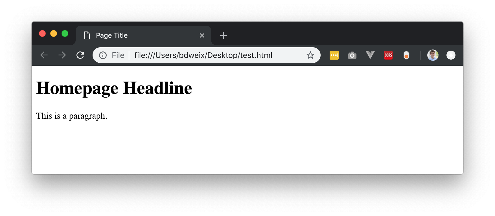
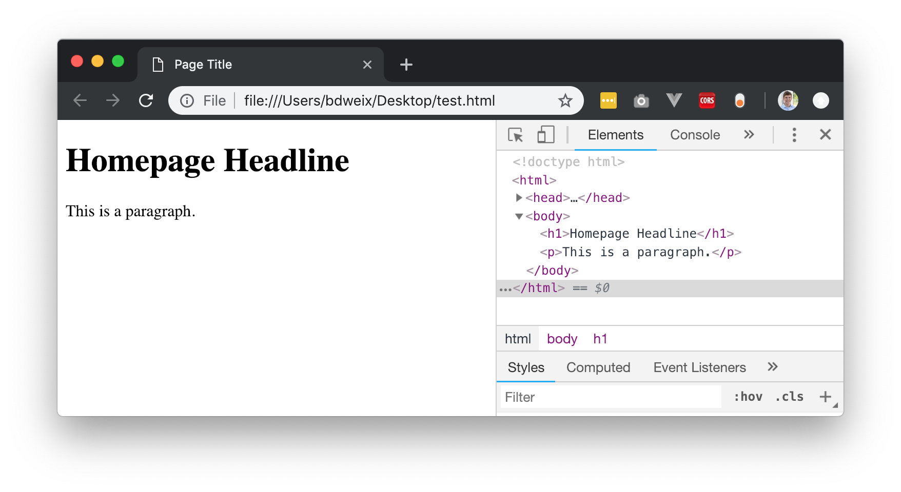
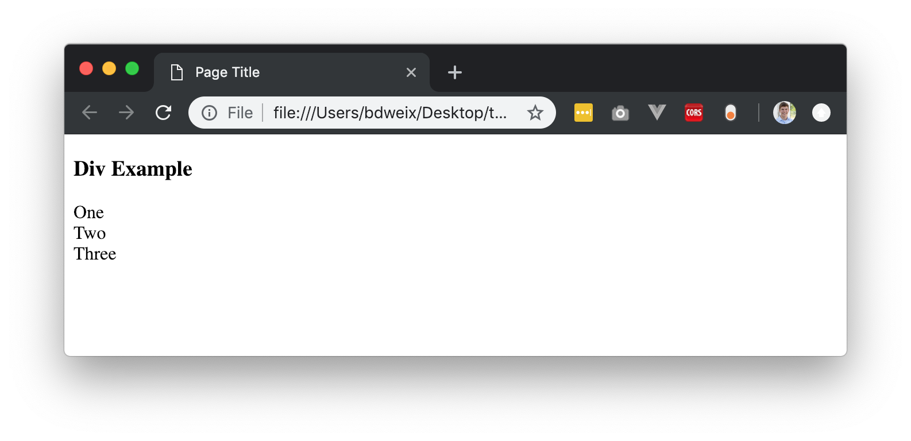
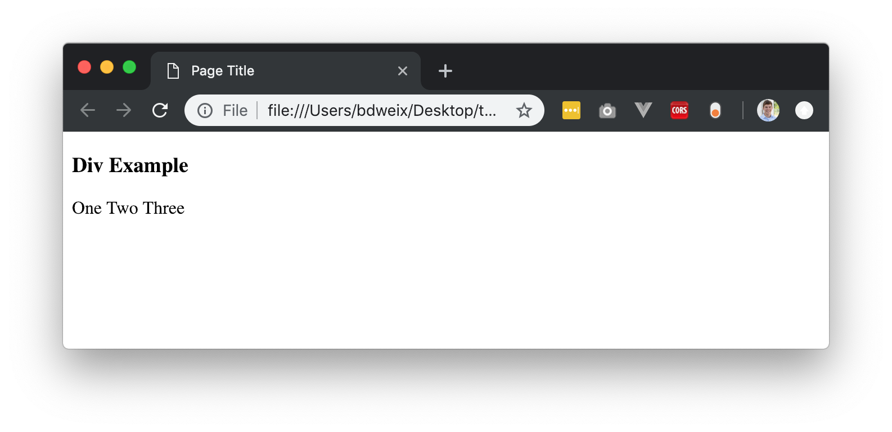
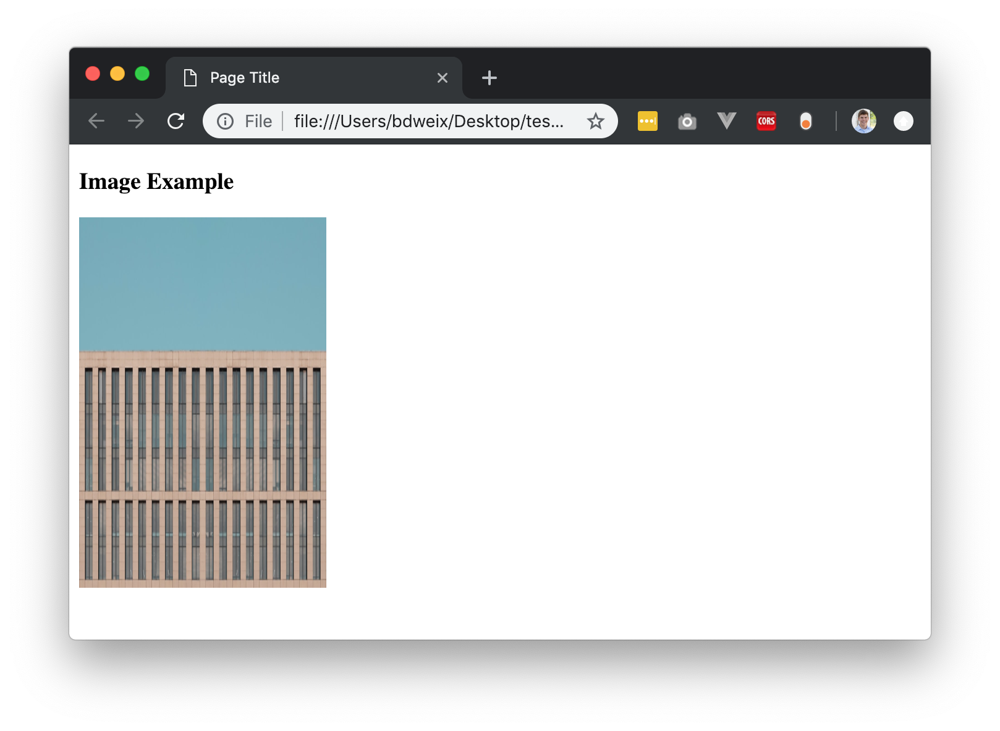

# Week 2: HTML + CSS

As we learned in the last week, the internet is all built on simple text! Even this website that you are reading right now is designed and rendered from simple lines of text. The language of this text is called `HTML` and it stands for **Hypertext Markup Language**. You can start to think of your web browser as a viewer that can "view" these files. Similar to how you use Microsoft Word to open and view Word documents, you use your web browser to view HTML files. We will discuss later on how CSS fits into this picture as well.

## The Basics of HTML

### Tags
Everything in HTML is built upon HTML tags. These tags are denoted with the carrot `<` `>` symbols. You can think of HTML as being compromised of sentences that represent different page elements that you see. For example, at the top of this page there is a search bar, this is simply an input feild that lets users type into.

Each tag comes in a pair, and has a starting and ending tag. They are usually denoted such that `<tagName>` begins like this, and ends with a backwards slash such as `</tagName>`. Everything between the two tags is the content, and the tags tell the browser what kind of content it will be.

**Note:** you must always have an opening and closing tag, otherwise your page will not load properly.

#### Tag Types
There hundreds of tag types! You can view a full [list here] (https://www.w3schools.com/tags/ref_byfunc.asp), but don't worry, you really only need to understand a few types to get things working. Here's the main ones:

| `<html>`        | Defines an HTML document                                    |
| :-------------- | :----------------------------------------------------------- |
| `<head>`        | Defines information about the document                       |
| `<title>`       | Defines a title for the document                             |
| `<body>`        | Defines the documents body                                   |
| `<h1>`...`<h6>` | Defines Headings of descending size                          |
| `<p>`           | Defines a paragraph                                          |
| `<br>`          | Inserts a single line break (Note: you do not need a closing tag here) |
| `<hr>`          | Inserts a line break (Note: you do not need a closing tag here) |
| `<!--`...`-->`  | Defines a comment (will not appear in the browser)           |
| `<div>`         | Defines a section in a document                              |
| `<span>`         | Defines a section in a document                              |
| `<input>`         | Used to accept user inputs on a page                              |
| ``         | Inserts an img (Note: you do not need a closer tag here)                              |
| `<a>`         | Inserts a link (Note: href attribute is often required                            |

### Basic HTML Document

Now that we know some of the basic tags, let's take a minute to look at a basic HTML document. Just like any Word document you'd right, there some required components of any `HTML` file. This is what a standard document looks like:

```html
<!DOCTYPE html>
<html>
    <head>
        <title>Page Title</title>
    </head>
    <body>
        <h1>Homepage Headline</h1>
        <p>This is a paragraph.</p>
    </body>
</html>
```

As you may notice, tags become nested within other tags. You can read this by looking at the indendation structure. There is a `<html>``</html>` tag pair that wraps the entire document, this tells the browser that everything between the two tags is an HTML document. You'll then see that the document has two main sections:

1. `<head>` - The head is at the top of the document and used to define page information and attributes. In this case we define the page title (this appears at the top of your browser), and we can define other attributes such as language and author as well.
2. `<body>` - The body is where the majority of the page content is hosted. This will have all of your text and features and images.

What does this HTML look like now? 

We can see at the top of our browser the tab shows the "Page Title", which is specifed between the `<title>` tags in the document `<head>`. If you change this title, it will change in your browser! Next we will see that the page has the largest sized header value (`<h1>`) with the words "Homepage Headline". Finally you can see the body text being display. 

Rememeber last week when we learned about Inspecting elements in Chrome? We can do that now too. Simply right click (control-click on Mac) and hit "Inspect". You will now be able to interact directly with the web page HTML, you can even change values.



### Creating your own HTML Document

Before we dive into more details about HTML, try setting up your own HTML document with what you've learned so far. Open Atom and in hit `Command N` (Mac) to create a new file, or go to the toolbar and hit `File > New File`. In the pop up window, enter the name for your new file: `MyWebpage.html`

You now have a blank HTML document that you can write anything you want in! Try copy/pasting the template we provided above and changing around the values. Go ahead and start playing some of the additional tag types as well. Once you want to see it, simply save the document to your Desktop (or wherever you want). Then go to the document and click it to open - it'll autoamtically open in your browser! Congrats you just made your own website.

### Div's 

The div tag is a block level HTML element. It is used to **divide** or **section** of other HTML tags in to meaningful groups. A perfect example of the use of a div tag is to designate an un-ordered list:

``` html
<div id="navigation_list">
  <ul>
    <li><a href="/home">Home</a></li>
    <li><a href="/about">About</a></li>
    <li><a href="/contact">Contact</a></li>
  </ul>
</div>
```

As you can see, this list is wrapped by a `<div>` tag with the ID of "navigation_list". We'll get into what `id` and `href` means in the following section, but look at the interior tags here. We have a `<ul>` tag which stands for `Unordered List` and within it are any number of `<li>`'s which stand for `List Items`. Another way to think about div's is that they are the "horizontal rows" on your webpage. Just as you read a document from left to row, row by row, your browser renders a webpage line by line. 

Let's look at what another example looks like, here we are placing three divs next to each other.

```html
  <h3>Div Example</h3>

  <div>One</div>
  <div>Two</div>
  <div>Three</div>
```

Note: this code is all within the `<body>` tag, I'm excluding that for redundacy here. This code generates a view looking like this: 



### Span's

Spans are very similar to divs, however spans are often used to display things within a single line. Let's look at the same example but using spans instead:

``` html
 <h3>Div Example</h3>

  <span>One</span>
  <span>Two</span>
  <span>Three</span>
```

This builds a view with everything in line:



I know these seem basic, but these are the building blocks of the internet! You'll quickly see how we can use CSS to turn basic examples into fancy websites.

### Tag Attributes

So far we've avoided talking about Tag Attributes, these are a vital part of the HTML language. Attributes are writen **within** the first `<starting>` tag. Here's an example of the `<a>` (link) tag with some attributes:

```html
<a href="www.google.com" class="link_class" id="google_button">Click to go to google!</a>
```

I know this looks like a lot, but let's break up what's going on here. As you can see, the attributes are denoted such that `key`=`"value"`. You'll see that for every key you need it to be followed by an equal sign, which in turn needs to be followed by a string (hence the double quotes to signify a string).

The first attribute we have here is the `href` attribute, this is an attribute that is specific to the `<a>` tag.  It stands for `hypertext reference` and is the link where we want the link to go! This means when a user clicks on the text "Click to go to google!" they will be brought to "www.google.com". Sometimes users will be linked to other pages on your website or even other websites entirely. 

The second attribute is the `class` attribute, and this is one of the most important attributes that you will see almost everywhere. This defines the class of CSS that will be used. We'll cover this in the CSS section.

Finally we have an `id` attribute that is set to "google_button". This is a **unique** identifer that represents this `<a>` tag. Note: id names must be unique and cannot be reused anywhere, whereas class names can be (and should be!) reused everywhere.

#### Example with Images

Let's take a look at the `` tag and see how we can use attributes to display an image. We'll be using images that are hosted from [Unsplash](https://source.unsplash.com/). This website will provide us with free images. A standard image take looks like this:

```html

```

As you may remember, we do not need a closing tag with an ``. The first important attribute for img is that "src" attribute, which defines the source of the image. In this case we are using the random image link from Unsplash. The following two attributes are straitforward then, `width` and `height`. These are defined in `px` (pixels) which say how much room the image should take up. All said and done it looks like this:



As you can see, we inserted an image which is of size 200x300 pixels.

### List of Potential Tag Attributes

There are hundreds of potential tags and attributes, but you only need to know the basic ones. Here's what we recommend knowing:

| Attribute | Description                                                  |
| --------- | ------------------------------------------------------------ |
| class     | Associates element with CSS class                            |
| style     | Opens inline CSS options                                     |
| id        | Unique identifier for the element                            |
| src       | Used to define image sources                                 |
| href      | Used to define link destinations                             |
| title     | Sets the title of an element (good for SEO and accessibility) |

## Introduction to CSS

Now that you've been introduced to the basics of HTML, you're probably wondering how in the world a beautiful looking website like Facebook can be built with just those components. Well it can't! Not without CSS that is. CSS stands for `Cascading Style Sheets` and these let you define how page elements look. HTML lets you create the structure of a page, and CSS lets you paint/design what that structure looks like. You wouldn't use CSS to move an element to a different position on the page, but you would use it to make the element a different color.

### General Style Properties

Every element on the page has a set of CSS styles that can be applied to it. There are some basics which apply to all.

### Utilizing Class Names

### Linking Stylesheets

### Flexboxes

## Designing Complete Webpage

Example: https://www.w3schools.com/w3css/w3css_templates.asp

## Resources

One of the best resources on the web for HTML and CSS is www.w3schools.com. We'd highly recommend using their site and researching various questions you have there.


